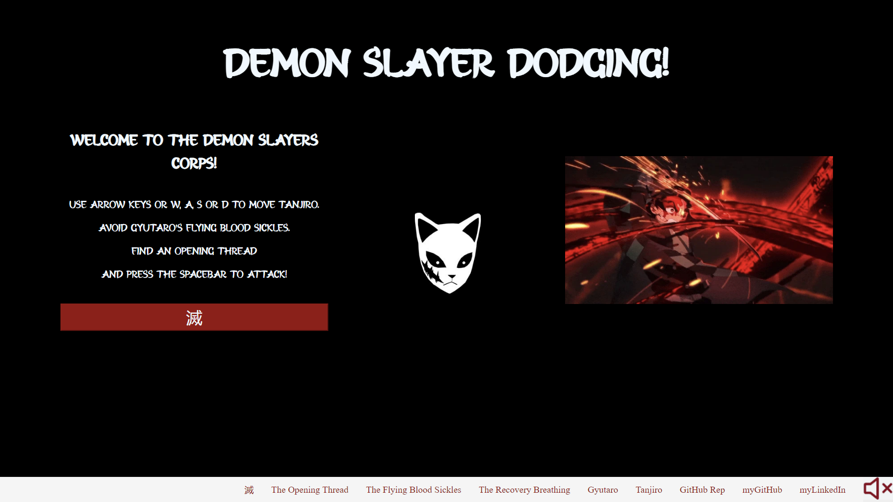

# Demon Slayer Dodging :izakaya_lantern:

IronHack Project 1 - [Game](https://joaomiguelinacio.github.io/demon-slayer-dodging/)



## Introduction :japanese_goblin:

5 weeks into the IronHack Web Development we were asked to develop a game to showcase what we had learnt about HTML, CSS and Javascript. :face_with_spiral_eyes:

A few weeks had passed since the last Demon Slayer Episode aired and I couldn't miss this opportunity to dive back into it!

# Gameplay :exploding_head:

We will revisit the last fight of the Entertainment District Arc of Demon Slayer, against Gyutaro. :star_struck:

In the game, we will have to avoid the obstacles thrown at us (The Flying Blood Sickles) and move towards the enemy until he is within the range of our attack.


As cool as it is to just watch the attack effect or to hear the slashing sound of our katana, attacking outside the range will have no pratical effect. 

# Approach :monocle_face:

## Player :smiling_face_with_three_hearts:


We will be playing as Tanjiro Kamado! After trying to draw different stances on paint for what felt like 1-2 days, @[Flow-fly](https://github.com/Flow-Fly) introduced me to sprites. Talk about game changer! :sunglasses:

Using the arrow keys and W, S, A, D we will be able to control Tanjiro's movement and we will be using our frameCounter to animate our movement.

```
moveUp() {
    if (this.y > 5) {
        this.y -= this.playerSpeed;
        if (frameCounter % 4 ===0){
            this.image.src = "./assets/images/TanjiroPosition1UP.png";
        } else {
        this.image.src = "./assets/images/TanjiroPosition2UP.png";
        }
    }
}
```

The attack animation is defined differently but more on that @[player-attack.js](https://github.com/joaoMiguelInacio/demon-slayer-dodging/blob/main/javascript/player-attack.js).

## Enemy :zombie:

We will be fighting Gyutaro, one of the twelve Kizuki! I also tried drawing him from scratch using paint but then @[Ines Herminio](https://github.com/inesherminio) told me he looked like he was drinking coffee and that is when I thought I should change it. :rofl:

The enemy will move randomly on the y axis every 30 frames and fires obstacles from wherever he is.

```
move(){
        enemy.y = Math.floor(Math.random()*(this.canvas.height - this.height));
    }
```


## Obstacles :drop_of_blood:

The obstacles will move towards you at different speeds and will be throw at you in different intervals depending on which level you are! :collision:

#Level 1: Objects thrown every 30 frammes @ Speed of 10

#Level 2 all before and: Objects thrown every 70 frammes @ Speed of 12

#Level 3 all before and: Objects thrown every 160 frammes @ Speed of 14

#Final Level all before and: Objects thrown every 340 frammes @ Speed of 16

## Tanjiro's Lives logic :blue_heart: 

Every time you collide with an obstacle you loose a life and you lose the game if your lifes are depleted.

Bear in mind that you are so determined to fight the evil that you will keep fighting for another turn even after everything seemed lost! :fire:


## Gyutaro's Lives and Levels logic :heart:

Your opponent will get more frustrated with every blow you deliver and increase the game level. :angry:

You can see what happens when the enemy loses his first life point in the following Javascript snippet:

```
function playerAttacksSuccessfully(){
    
    //if enemy has all lifes
    if (enemyLifesArray.length===4){
        document.addEventListener('keydown', (e) => {
            
            //and you press the space bar whilst having the enemy within your katana's range
            if (e.key === " " && (player.x >= (canvas.width*0.7)) && ((player.y-enemy.y) <= 200)){
                e.preventDefault();
                
                //you will take one of his lifes
                enemyLosingLife1();
                
                //and increase the game difficulty
                increaseDifficulty1();
                ...
            }
        });
    }
}

//the increase difficulty function pushes some text into the difficulty1Array which was empty
function increaseDifficulty1() {
    difficulty1Array.push("difficulty1");
}

function update (){ 
    ...
    //as difficulty1Array is no longer empty the enemy throws a faster type of obstacles
    if (frameCounter % 70 === 0 && difficulty1Array.length >= 1){
                obstaclesArray.push(new Obstacles1(canvas, ctx));
    }
}
```


## SPOILER ALERT :heavy_exclamation_mark:

DO NOT PLAY THE VIDEO if you haven't watched the anime YET!

## Thank you :bowing_man:
@[Ian](https://github.com/idelace)'s son for choosing such an amazing name and being so enthusiastic about the game!

@[Nelson](https://github.com/nlfonseca) and @[Ana](https://github.com/anaresende) for your unvaluable tips and advice!

@[Helena Saborit](https://github.com/Helsinky91) for helping me stay focused in class!

## Backlog :hospital:

Because life at work can't wait, this will have to:
    
    1. Find a way to isolate Vimeo's video play button, addEventListener and create dim lights function (that would turn background from white to black and stop music when video starts);

    2. Make Zenitsu a playable character. He is already everyone's favourite! :zap:

    3. Create a multiplayer version of the game where Gyutaro stands in the middle of the canvas and throws objects towards Tanjiro on the left and Zenitsu on the right. Player A would use A,W,S,D to move and Player B would use the arrow keys.

    12934. Make game Mobile Ready.

## Dataset :nerdface:

 |-- .assets
    |-- .fonts 
    |-- .images
    |-- .music
 |-- .javascript
    |-- background.js (contains Background Class)
    |-- enemy-attacks.js (contains enemyAttacksSuccessfully1/2/3 functions)
    |-- enemy-life-points.js (contains enemyLosingLife1/2/3 functions)
    |-- enemy.js (contains Enemy Class)
    |-- extra.js 
    |-- game-lost.js (contains gameLost function that changes to screen2 using DOM)
    |-- game-won.js (contains gameWon function that changes to screen3 using DOM)
    |-- increase-difficulty.js (contains the difficulty defining functions)
    |-- index.js 
        (initiates 95% of the variables in use)
        (contains startButton addEventListener)
        (and contains startGame and updateFunction)
    |-- obstacle.js (contains all Obstacle Classes)
    |-- opening-thread.js (contains opening-thread function)
    |-- player.attack.js
        (contains backToOriginalStance function)
        (contains playerAttacksSuccessfully1/2/3 functions)
        (contains playerAttacksForNothing function)
    |-- player-life-points.js (contains playerLosingLife1/2/3 functions)
    |-- player.js (contains Player Class)
    |-- reset.js (contains reset function)
    |-- sound-effects 
        (contains playLostScreenMusic)
        (contains playFightScreenMusic function)
        (contains playFirstScreenMusic function)
        (contains AttackMusic function)
        (contains musicON/OFF buttons addEventListeners)
        (contains musicON/OFF functions)
 |-- .styles
    |--styles.css
 |-- index.html
 |-- README.md